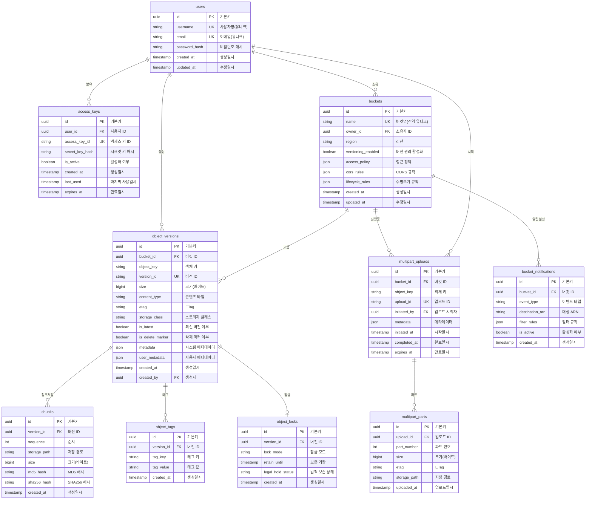

# S3 호환 객체 저장소 완전판 ERD

## 전체 엔티티 관계도



## 테이블 상세 설명

### 핵심 테이블

#### users (사용자)
- 사용자 계정 관리
- `id`: UUID 기본키
- `username`: 고유 사용자명
- `email`: 이메일 주소
- `password_hash`: Bcrypt 해시된 비밀번호
- 감사용 타임스탬프

#### access_keys (액세스 키)
- AWS 호환 인증 자격증명
- `access_key_id`: 공개 액세스 키 (20자, 예: AKIA...)
- `secret_key_hash`: 해시된 시크릿 키
- `is_active`: 키 활성화/비활성화
- `expires_at`: 선택적 만료 시간
- `last_used`: 사용 추적

#### buckets (버킷)
- S3 호환 버킷 (전체 기능)
- `name`: 전역적으로 고유한 버킷명
- `versioning_enabled`: 객체 버전 관리 플래그
- `access_policy`: 버킷 정책 JSON
- `cors_rules`: CORS 설정
- `lifecycle_rules`: 객체 수명주기 정책

### 객체 저장 테이블

#### object_versions (객체 버전)
- 완전한 버전 관리
- `object_key`: 버킷 내 객체 경로
- `version_id`: 고유 버전 식별자
- `is_latest`: 현재 버전 플래그
- `is_delete_marker`: 소프트 삭제 표시
- `storage_class`: STANDARD/INFREQUENT_ACCESS/GLACIER
- `metadata`: 시스템 메타데이터
- `user_metadata`: x-amz-meta-* 헤더

#### chunks (청크)
- 대용량 객체용 4MB 데이터 청크
- `version_id`: 특정 객체 버전 연결
- `sequence`: 청크 순서 (0부터 시작)
- `storage_path`: 파일시스템 위치
- 무결성 검증용 해시값

#### object_tags (객체 태그)
- 버전별 키-값 태그
- S3 객체 태깅 API 지원
- 수명주기 규칙 및 접근 제어에 사용

### 업로드 관리

#### multipart_uploads (멀티파트 업로드)
- 진행 중인 멀티파트 업로드
- `upload_id`: S3 호환 식별자
- `expires_at`: 자동 중단 타임스탬프
- `metadata`: 업로드 메타데이터

#### multipart_parts (멀티파트 파트)
- 개별 업로드 파트
- `part_number`: 1-10000 범위
- `storage_path`: 임시 파트 위치
- 완료 시 병합

### 고급 기능

#### bucket_notifications (버킷 알림)
- 이벤트 알림 설정
- `event_type`: s3:ObjectCreated:* 등
- `destination_arn`: SNS/SQS/Lambda 대상
- `filter_rules`: 접두사/접미사 필터

#### object_locks (객체 잠금)
- 컴플라이언스 및 거버넌스 모드
- `lock_mode`: COMPLIANCE/GOVERNANCE
- `retain_until`: 보존 날짜
- `legal_hold_status`: ON/OFF

## 구현 참고사항

### 버전 관리 전략
1. **신규 업로드**: 새 버전 생성, `is_latest=true` 설정, 이전 버전은 `false`로 변경
2. **삭제 (버전관리 ON)**: `is_delete_marker=true`인 삭제 마커 생성
3. **삭제 (버전관리 OFF)**: 모든 버전 하드 삭제
4. **최신 가져오기**: `is_latest=true` AND `is_delete_marker=false` 필터링

### 멀티파트 업로드 플로우
1. **시작**: `upload_id`로 업로드 레코드 생성
2. **파트 업로드**: 각 파트를 임시 경로에 저장
3. **완료**:
   - 순서대로 파트 병합
   - 새 객체 버전 생성
   - 임시 파트 정리
4. **중단**: 업로드 레코드와 모든 파트 제거

### 저장 경로 구조
```
/storage/
├── objects/
│   ├── {bucket-id}/
│   │   └── {object-key-hash[0:2]}/
│   │       └── {object-key-hash[2:4]}/
│   │           └── {version-id}
└── temp/
    └── multipart/
        └── {upload-id}/
            └── part-{number}
```

### 보안 고려사항
- 시크릿 키는 평문으로 저장하지 않음
- `expires_at`을 통한 액세스 키 순환 지원
- 세밀한 접근 제어를 위한 JSON 버킷 정책
- 컴플라이언스 요구사항을 위한 객체 잠금

### S3 API 호환성
- 기본 CRUD 작업
- 버전 관리 지원
- 멀티파트 업로드
- 객체 태깅
- 접근 제어 (IAM 스타일)
- 이벤트 알림 (스키마만)
- 객체 잠금/보존
- 교차 리전 복제 (미포함)
- S3 Select (미포함)
- 배치 작업 (미포함)

이 ERD는 Alex Xu의 S3 호환 객체 저장소 구현을 위한 모든 필수 기능을 제공합니다.