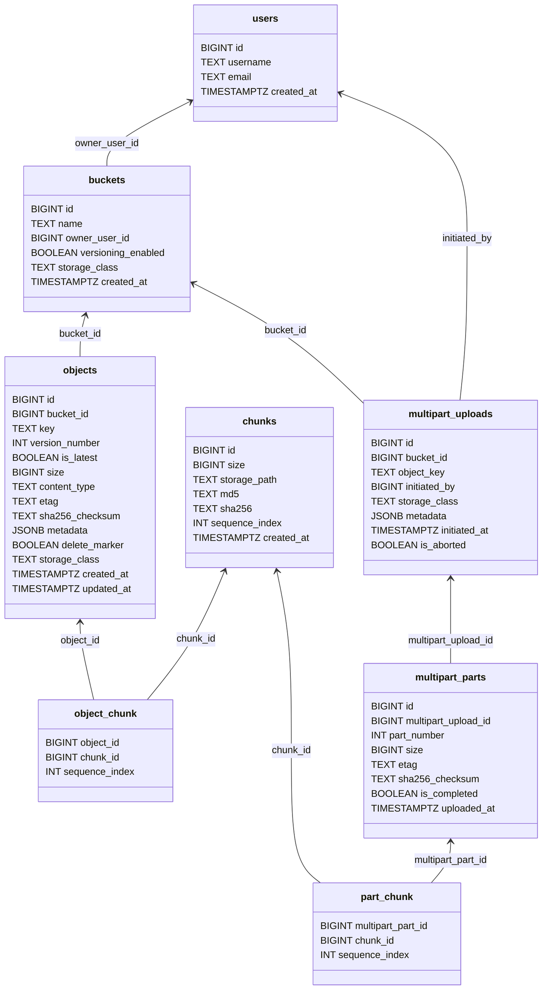

```mermaid
%% mermaid class diagram for S3-Lite schema
classDiagram
direction BT

class users {
    BIGINT id
    TEXT username
    TEXT email
    TIMESTAMPTZ created_at
}

class buckets {
    BIGINT id
    TEXT name
    BIGINT owner_user_id
    BOOLEAN versioning_enabled
    TEXT storage_class
    TIMESTAMPTZ created_at
}

class objects {
    BIGINT id
    BIGINT bucket_id
    TEXT key
    INT version_number
    BOOLEAN is_latest
    BIGINT size
    TEXT content_type
    TEXT etag
    TEXT sha256_checksum
    JSONB metadata
    BOOLEAN delete_marker
    TEXT storage_class
    TIMESTAMPTZ created_at
    TIMESTAMPTZ updated_at
}

class chunks {
    BIGINT id
    BIGINT size
    TEXT storage_path
    TEXT md5
    TEXT sha256
    INT sequence_index
    TIMESTAMPTZ created_at
}

class object_chunk {
    BIGINT object_id
    BIGINT chunk_id
    INT sequence_index
}

class multipart_uploads {
    BIGINT id
    BIGINT bucket_id
    TEXT object_key
    BIGINT initiated_by
    TEXT storage_class
    JSONB metadata
    TIMESTAMPTZ initiated_at
    BOOLEAN is_aborted
}

class multipart_parts {
    BIGINT id
    BIGINT multipart_upload_id
    INT part_number
    BIGINT size
    TEXT etag
    TEXT sha256_checksum
    BOOLEAN is_completed
    TIMESTAMPTZ uploaded_at
}

class part_chunk {
    BIGINT multipart_part_id
    BIGINT chunk_id
    INT sequence_index
}

%% relationships
buckets --> users : owner_user_id
objects --> buckets : bucket_id
object_chunk --> objects : object_id
object_chunk --> chunks : chunk_id
multipart_uploads --> buckets : bucket_id
multipart_uploads --> users : initiated_by
multipart_parts --> multipart_uploads : multipart_upload_id
part_chunk --> multipart_parts : multipart_part_id
part_chunk --> chunks : chunk_id
```