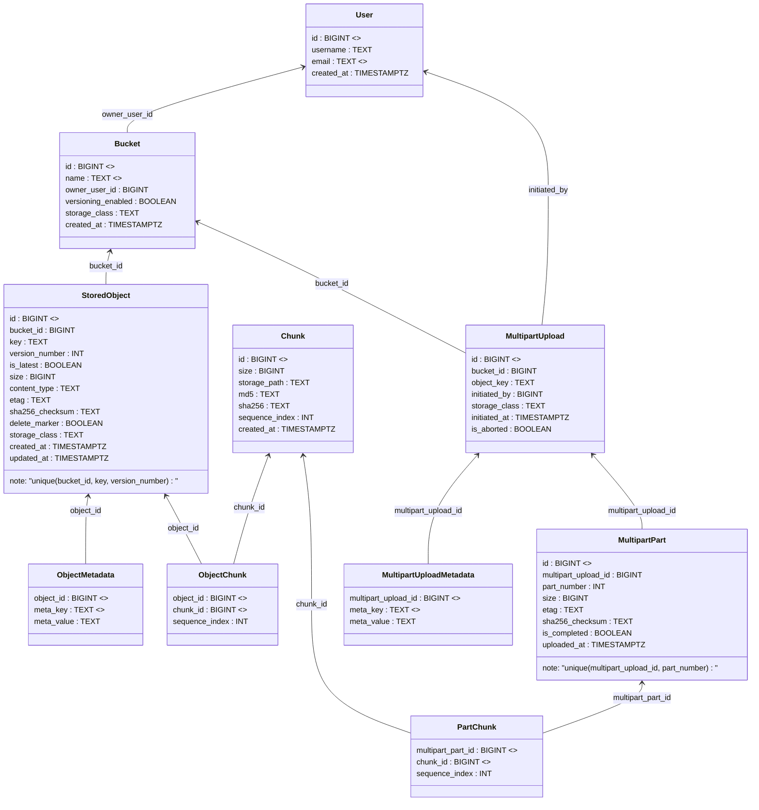

```mermaid
%% mermaid class diagram for S3-Lite schema (normalized metadata, no jsonb)
classDiagram
direction BT

class User {
id : BIGINT <<PK>>
username : TEXT
email : TEXT <<UNIQUE>>
created_at : TIMESTAMPTZ
}

class Bucket {
id : BIGINT <<PK>>
name : TEXT <<UNIQUE>>
owner_user_id : BIGINT
versioning_enabled : BOOLEAN
storage_class : TEXT
created_at : TIMESTAMPTZ
}

class StoredObject {
id : BIGINT <<PK>>
bucket_id : BIGINT
key : TEXT
version_number : INT
is_latest : BOOLEAN
size : BIGINT
content_type : TEXT
etag : TEXT
sha256_checksum : TEXT
delete_marker : BOOLEAN
storage_class : TEXT
created_at : TIMESTAMPTZ
updated_at : TIMESTAMPTZ
note: "unique(bucket_id, key, version_number)"
}

class ObjectMetadata {
object_id : BIGINT <<PK>>
meta_key : TEXT <<PK>>
meta_value : TEXT
}

class Chunk {
id : BIGINT <<PK>>
size : BIGINT
storage_path : TEXT
md5 : TEXT
sha256 : TEXT
sequence_index : INT
created_at : TIMESTAMPTZ
}

class ObjectChunk {
object_id : BIGINT <<PK>>
chunk_id : BIGINT <<PK>>
sequence_index : INT
}

class MultipartUpload {
id : BIGINT <<PK>>
bucket_id : BIGINT
object_key : TEXT
initiated_by : BIGINT
storage_class : TEXT
initiated_at : TIMESTAMPTZ
is_aborted : BOOLEAN
}

class MultipartUploadMetadata {
multipart_upload_id : BIGINT <<PK>>
meta_key : TEXT <<PK>>
meta_value : TEXT
}

class MultipartPart {
id : BIGINT <<PK>>
multipart_upload_id : BIGINT
part_number : INT
size : BIGINT
etag : TEXT
sha256_checksum : TEXT
is_completed : BOOLEAN
uploaded_at : TIMESTAMPTZ
note: "unique(multipart_upload_id, part_number)"
}

class PartChunk {
multipart_part_id : BIGINT <<PK>>
chunk_id : BIGINT <<PK>>
sequence_index : INT
}

%% relationships
Bucket --> User : owner_user_id
MultipartUpload --> User : initiated_by
StoredObject --> Bucket : bucket_id
ObjectMetadata --> StoredObject : object_id
ObjectChunk --> StoredObject : object_id
ObjectChunk --> Chunk : chunk_id
MultipartUpload --> Bucket : bucket_id
MultipartUploadMetadata --> MultipartUpload : multipart_upload_id
MultipartPart --> MultipartUpload : multipart_upload_id
PartChunk --> MultipartPart : multipart_part_id
PartChunk --> Chunk : chunk_id
```